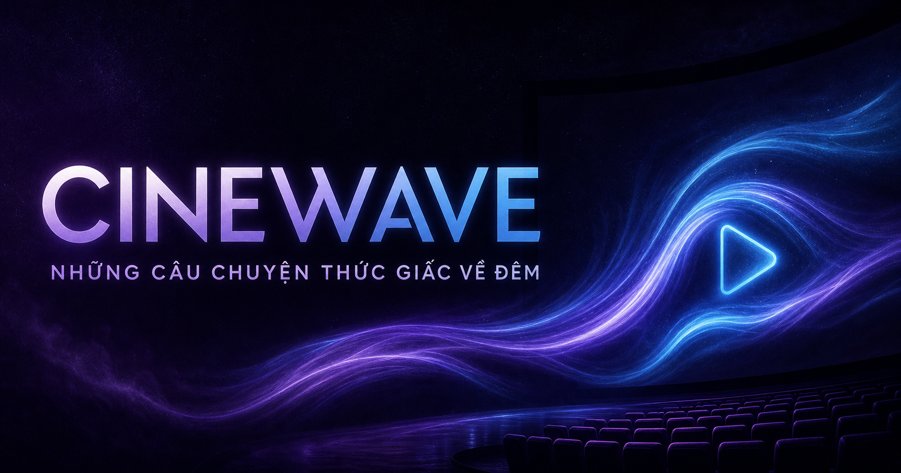

# CineWave

CineWave là ứng dụng xem phim nguồn mở/được cấp phép, xây dựng bằng React, Next.js qua Vinext và chạy trên Cloudflare Workers. Dự án có đầy đủ khu vực người xem, trình phát video, nhiều hồ sơ, gợi ý phim, thanh toán VietQR/SePay và trang quản trị theo vai trò.



## Chức năng chính

- Khám phá, tìm kiếm và xem chi tiết phim.
- Phát MP4/WebM/HLS, phụ đề WebVTT, tiếp tục xem và lưu lịch sử.
- Đăng ký, đăng nhập, quản lý nhiều hồ sơ và giới hạn nội dung trẻ em.
- Danh sách yêu thích, đánh giá, lịch sử xem và gợi ý phim theo ngữ cảnh.
- Gói thành viên, tạo mã VietQR và nhận trạng thái thanh toán từ SePay.
- CMS quản lý phim, lịch phát hành, blog, chương trình và podcast.
- Admin analytics, quản lý tài khoản, RBAC, audit log và giám sát hệ thống.
- D1 lưu dữ liệu ứng dụng; R2 lưu media; Supabase PostgreSQL hỗ trợ schema catalog/recommendation tùy chọn.

## Công nghệ sử dụng

| Thành phần | Công nghệ |
| --- | --- |
| Giao diện | React 19, Next.js 16, Vinext, Tailwind CSS |
| Runtime | Cloudflare Workers, Vite |
| Database chính | Cloudflare D1, Drizzle ORM |
| Media | Cloudflare R2, MP4/WebM/HLS, WebVTT |
| Database tùy chọn | Supabase PostgreSQL, RLS, pgTAP |
| Kiểm thử | Node Test Runner, Playwright, Python unittest |
| CI | GitHub Actions |

## 1. Yêu cầu môi trường

Bắt buộc để chạy website:

- Git.
- Node.js `>= 22.13.0`.
- npm đi kèm Node.js.

Chỉ cần khi dùng tính năng tương ứng:

- Python 3.12+ để chạy crawler và test crawler.
- Docker Desktop cùng Supabase CLI `2.102.0` để dựng và kiểm thử Supabase local.
- Tài khoản Cloudflare để triển khai Workers/D1/R2 và dùng Turnstile production.
- Tài khoản Supabase, TMDB hoặc SePay nếu bật các tích hợp này.

Kiểm tra phiên bản Node.js và npm:

```bash
node --version
npm --version
```

## 2. Tải mã nguồn và cài đặt

```bash
git clone https://github.com/trandinhbaokhang118-tdk/movie-website.git
cd movie-website
npm ci
```

Tạo file môi trường trên Windows PowerShell:

```powershell
Copy-Item .env.example .env.local
```

Trên macOS/Linux:

```bash
cp .env.example .env.local
```

`.env.local` đã được Git bỏ qua. Không commit file này và không đưa secret thật vào source code.

## 3. Cấu hình chạy local tối thiểu

Mở `.env.local` và đặt tối thiểu:

```dotenv
CINEWAVE_LOCAL_AUTH=1
ADMIN_EMAILS=admin@example.com
CINEWAVE_RECOMMENDER_MODE=off
CINEWAVE_RECOMMENDER_CANARY_PERCENT=10
```

Thay `admin@example.com` bằng email bạn sẽ dùng để đăng ký tài khoản quản trị. Có thể dùng nhiều email, ngăn cách bằng dấu phẩy:

```dotenv
ADMIN_EMAILS=admin@example.com,owner@example.com
```

`CINEWAVE_LOCAL_AUTH=1` chỉ bỏ qua Turnstile khi request đến từ `localhost` hoặc `127.0.0.1`. Production luôn phải đặt biến này thành `0`.

Website vẫn chạy được nếu chưa cấu hình Supabase, TMDB hoặc thanh toán. Những tích hợp còn thiếu sẽ ở trạng thái `disabled` thay vì dùng dữ liệu giả.

## 4. Khởi động dự án

```bash
npm run dev
```

Mở [http://localhost:3000](http://localhost:3000). D1 và R2 local được Wrangler/Miniflare quản lý trong thư mục `.wrangler/`; schema D1 được khởi tạo khi ứng dụng nhận request đầu tiên.

Nếu cổng `3000` đang được sử dụng:

```bash
npm run dev -- --host 127.0.0.1 --port 3001
```

Sau khi sửa `.env.local`, hãy dừng và chạy lại development server để nạp cấu hình mới.

## 5. Tạo tài khoản và sử dụng website

### Người xem

1. Mở `/register` và đăng ký bằng email, tên hiển thị, mật khẩu.
2. Đăng nhập tại `/login` nếu chưa có phiên.
3. Tạo hoặc chuyển hồ sơ tại `/profiles`.
4. Duyệt phim tại `/browse`, tìm kiếm tại `/search` hoặc xem gợi ý tại `/night`.
5. Mở `/title/[id]` để xem thông tin, thêm vào danh sách hoặc bắt đầu phát.
6. Theo dõi danh sách tại `/my-list` và lịch sử tại `/history`.
7. Quản lý thiết bị, mật khẩu, quyền riêng tư và dữ liệu cá nhân tại `/account`.
8. Xem gói thành viên tại `/plans`. Thanh toán chỉ hoạt động khi VietQR và SePay đã được cấu hình đầy đủ.

### Quản trị viên

1. Đảm bảo email cần cấp quyền đã có trong `ADMIN_EMAILS` trước khi khởi động server.
2. Đăng ký hoặc đăng nhập bằng đúng email đó.
3. Truy cập [http://localhost:3000/admin](http://localhost:3000/admin).
4. Super Admin có thể gán các vai trò khác tại `/admin/permissions`.

| Vai trò | Quyền |
| --- | --- |
| Super Admin | Toàn bộ dashboard, nội dung, tài khoản, phân quyền, hệ thống và audit |
| Content Manager | Tổng quan, analytics và quản lý nội dung |
| Support | Tổng quan, quản lý tài khoản và audit |
| Analyst | Tổng quan và analytics chỉ đọc |

Các khu vực admin thường dùng:

- `/admin/content`: quản lý phim và metadata.
- `/admin/schedule`: chương trình và lịch phát hành.
- `/admin/blog`: bài viết.
- `/admin/podcast`: tập podcast.
- `/admin/analytics`: hiệu suất phim, blog, chương trình và podcast.
- `/admin/accounts`: khóa hoặc mở khóa tài khoản.
- `/admin/permissions`: gán vai trò.
- `/admin/system`, `/admin/security`: trạng thái runtime và bảo mật.
- `/admin/configuration`: audit log.

Nếu truy cập `/admin` nhưng bị chuyển về `/account`, hãy kiểm tra email đăng nhập có khớp hoàn toàn với `ADMIN_EMAILS` và đã khởi động lại server sau khi đổi `.env.local` hay chưa.

## 6. Biến môi trường

| Biến | Mục đích | Khi nào cần |
| --- | --- | --- |
| `CINEWAVE_LOCAL_AUTH` | Cho phép xác thực local không cần Turnstile thật | Đặt `1` khi phát triển local; production đặt `0` |
| `ADMIN_EMAILS` | Danh sách email bootstrap Super Admin | Khi cần truy cập `/admin` |
| `CINEWAVE_RECOMMENDER_MODE` | Chế độ `off`, `shadow`, `canary` hoặc `active` | Khi triển khai hybrid recommender |
| `CINEWAVE_RECOMMENDER_CANARY_PERCENT` | Phần trăm người dùng thuộc nhóm canary | Khi mode là `canary` |
| `TMDB_ACCESS_TOKEN` | TMDB v4 bearer token | Đồng bộ metadata/trailer từ TMDB |
| `TMDB_API_KEY` | TMDB v3 API key thay thế access token | Đồng bộ metadata/trailer từ TMDB |
| `SUPABASE_URL` | URL Data API của Supabase project | Kiểm tra/kết nối Supabase |
| `SUPABASE_PUBLISHABLE_KEY` | Publishable key phía client/runtime | Kiểm tra/kết nối Supabase |
| `TURNSTILE_SITE_KEY` | Cloudflare Turnstile site key | Production |
| `TURNSTILE_SECRET_KEY` | Cloudflare Turnstile secret key | Production |
| `TURNSTILE_ALLOWED_HOSTNAMES` | Danh sách hostname được phép, ngăn cách bằng dấu phẩy | Production |
| `PAYMENT_BANK_CODE` | Mã ngân hàng nhận tiền VietQR | Bật thanh toán |
| `PAYMENT_BANK_ACCOUNT` | Số tài khoản nhận tiền | Bật thanh toán |
| `PAYMENT_ACCOUNT_NAME` | Tên chủ tài khoản | Bật thanh toán |
| `SEPAY_WEBHOOK_API_KEY` | Khóa xác thực webhook SePay | Bật thanh toán |

Không dùng Supabase secret key hoặc legacy `service_role` key cho `SUPABASE_PUBLISHABLE_KEY`; hai loại key đặc quyền này có thể bỏ qua RLS và không được xuất hiện trong trình duyệt hoặc repository.

## 7. Supabase local

Supabase không bắt buộc cho luồng xem phim chính. Phần này dùng để kiểm thử migrations, seed, RLS và nền tảng recommendation PostgreSQL.

1. Khởi động Docker Desktop.
2. Cài Supabase CLI `2.102.0` hoặc bảo đảm lệnh `supabase` cùng phiên bản có trong `PATH`.
3. Từ thư mục gốc dự án, chạy:

```bash
supabase db start
supabase test db --local
supabase db lint --local --level error --fail-on error
supabase db advisors --local --type all --level error --fail-on error
```

Nếu cần dựng lại database local hoàn toàn từ migrations và `supabase/seed.sql`:

```bash
supabase db reset --local
```

Lệnh trên xóa dữ liệu Supabase local hiện có; không dùng `--linked` với database production.

Xem URL/key local:

```bash
supabase status
```

Có thể đưa URL và publishable/anon key do local stack in ra vào `.env.local`:

```dotenv
SUPABASE_URL=http://127.0.0.1:54321
SUPABASE_PUBLISHABLE_KEY=<local-publishable-or-anon-key>
```

Dừng local stack khi hoàn tất:

```bash
supabase stop --no-backup
```

## 8. Catalog và media

Catalog mặc định nằm tại `data/licensed_catalog.json`. Chỉ đưa nội dung Creative Commons, Public Domain hoặc nội dung có quyền phân phối hợp lệ vào player.

Chạy crawler Internet Archive:

```bash
npm run catalog:crawl
```

Nhập metadata/trailer từ TMDB:

```bash
python tools/crawl_movies.py tmdb --token "$TMDB_ACCESS_TOKEN"
```

TMDB chỉ cung cấp metadata/trailer, không chứng minh quyền phát hành phim. Mỗi nội dung cần có nguồn, giấy phép, phạm vi sử dụng và attribution riêng.

Admin CMS hỗ trợ URL media ngoài hoặc upload poster, MP4/WebM, HLS, WebVTT và audio. Upload được lưu vào R2; video được phục vụ qua route same-origin có hỗ trợ HTTP Range và ETag.

## 9. Thanh toán VietQR và SePay

Để bật thanh toán:

1. Điền đủ `PAYMENT_BANK_CODE`, `PAYMENT_BANK_ACCOUNT`, `PAYMENT_ACCOUNT_NAME` và `SEPAY_WEBHOOK_API_KEY`.
2. Trên SePay, cấu hình webhook HTTPS đến `/api/webhooks/sepay`.
3. Chọn xác thực API key và giữ tiền tố mã thanh toán `CW`.
4. Kiểm tra đúng tài khoản thụ hưởng, mã hóa đơn và số tiền trước khi kích hoạt gói.

Thiếu một trong bốn biến trên sẽ làm tính năng thanh toán tự tắt. Localhost chỉ nhận webhook từ bên ngoài khi có tunnel HTTPS công khai.

## 10. Kiểm thử và kiểm tra chất lượng

| Lệnh | Công dụng |
| --- | --- |
| `npm run lint` | Kiểm tra ESLint |
| `npm run typecheck` | Kiểm tra TypeScript và Cloudflare Worker types |
| `npm run test:unit` | Unit test hybrid recommender và HTTP Range |
| `npm run catalog:test` | Test crawler bằng Python unittest |
| `npm test` | Build production và chạy contract test HTML |
| `npm run test:e2e` | Chạy toàn bộ Playwright E2E với D1 riêng |
| `npm run test:e2e:headed` | Chạy E2E có hiển thị trình duyệt |
| `npm run test:supabase` | Chạy pgTAP khi Supabase local đang hoạt động |
| `npm audit --omit=dev` | Kiểm tra dependency production |

Chạy bộ kiểm tra thường dùng:

```bash
npm run lint
npm run typecheck
npm run test:unit
npm run catalog:test
npm test
npm run test:e2e
npm audit --omit=dev
```

Playwright mặc định dùng cổng `3100`. Nếu cổng này bận, PowerShell có thể đổi cổng bằng:

```powershell
$env:CINEWAVE_E2E_PORT='3199'
npm run test:e2e
```

Trên macOS/Linux:

```bash
CINEWAVE_E2E_PORT=3199 npm run test:e2e
```

## 11. Database D1 và Drizzle

Sau khi thay đổi `db/schema.ts`, tạo migration mới:

```bash
npm run db:generate
```

Xem các bảng trong D1 local:

```bash
npm run db:status
```

Không sửa hoặc xóa migrations đã chạy trên production. Với thay đổi mới, tạo migration bổ sung và kiểm thử trên local/staging trước.

## 12. Build và triển khai

Build production:

```bash
npm run build
```

Chạy bản build ở local:

```bash
npm run start
```

Dự án được cấu hình cho OpenAI Sites/Cloudflare Workers qua `.openai/hosting.json`, với binding D1 là `DB` và R2 là `MEDIA`. Trước khi publish production:

1. Chạy toàn bộ kiểm thử và bảo đảm `npm run build` thành công.
2. Cấu hình các runtime variable/secret trên nền tảng hosting; không lấy secret từ `.env.local` đưa vào Git.
3. Đặt `CINEWAVE_LOCAL_AUTH=0`, dùng Turnstile production key và giới hạn `ADMIN_EMAILS`.
4. Kiểm tra D1 migrations, R2 binding, backup và quyền truy cập.
5. Sau deploy, gọi `/api/health`, đăng nhập, phát thử media và kiểm tra `/admin/system`.

`wrangler.jsonc` hiện dùng ID D1 placeholder cho local tooling. Không chạy deploy trực tiếp bằng Wrangler tới production trước khi cấu hình đúng database/bucket hoặc sử dụng quy trình Sites đã gắn với project.

## 13. Cấu trúc thư mục

```text
app/                      Routes, UI, server actions và API
app/admin/                Khu vực quản trị
app/components/           Component dùng chung
data/licensed_catalog.json
db/                       D1 runtime và Drizzle schema
drizzle/                  D1 migrations
lib/                      Catalog, TMDB, Supabase, recommendation
public/media/             Artwork và media nguồn mở local
supabase/migrations/      PostgreSQL migrations
supabase/tests/           pgTAP/RLS tests
tests/                    Unit, contract và crawler tests
e2e/                      Playwright tests
tools/                    Crawler và công cụ hỗ trợ
worker/                   Cloudflare Worker entrypoint và media range
docs/                     Tài liệu vận hành và bảo mật
```

## 14. Xử lý lỗi thường gặp

### Không đăng nhập/đăng ký được ở local

- Kiểm tra `CINEWAVE_LOCAL_AUTH=1`.
- Chỉ truy cập qua `localhost` hoặc `127.0.0.1`.
- Khởi động lại server sau khi sửa `.env.local`.

### Không vào được trang admin

- Email đăng nhập phải có trong `ADMIN_EMAILS`.
- Kiểm tra đúng địa chỉ email đã dùng để đăng ký tài khoản.
- Khởi động lại server rồi đăng nhập lại.

### Supabase CLI không chạy

- Bảo đảm Docker Desktop đang hoạt động.
- Dùng Supabase CLI `2.102.0` để khớp CI của repository.
- Chạy lệnh tại thư mục chứa `supabase/config.toml`.

### Playwright báo cổng đang được sử dụng

- Đóng development server đang chiếm cổng `3100` hoặc đặt `CINEWAVE_E2E_PORT` sang cổng khác.

### Thanh toán hiển thị tạm dừng

- Kiểm tra cả bốn biến `PAYMENT_*` và `SEPAY_WEBHOOK_API_KEY`; thiết kế của hệ thống là fail-closed khi cấu hình thiếu.

## Tài liệu liên quan

- [Trạng thái dự án](PROJECT_STATUS.md)
- [Vận hành, backup và incident response](docs/OPERATIONS.md)
- [Mô hình bảo mật](docs/SECURITY.md)
- [Production readiness gates](docs/PRODUCTION_READINESS_GATES.md)
- [Hybrid recommender model card](docs/recommendation/MODEL_CARD.md)

## Lưu ý phạm vi sử dụng

Phiên bản hiện tại phù hợp cho MVP streaming nguồn mở/được cấp phép ở quy mô nhỏ. Dự án chưa thay thế hệ thống DRM thương mại, pipeline transcoding nhiều rendition, malware scanning chuyên dụng, MFA/WebAuthn cho admin hoặc multi-region disaster recovery.

Không sử dụng metadata TMDB, trailer hoặc bản ghi Internet Archive để tự suy ra quyền phát hành. Người vận hành chịu trách nhiệm xác minh giấy phép trước khi xuất bản nội dung.
